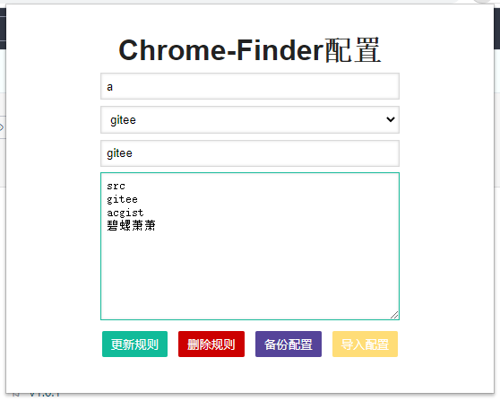
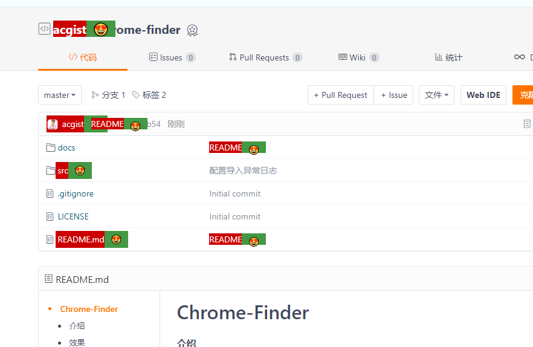

# Chrome-Finder

Chrome浏览器多关键词搜索

----

## 使用

快速搜索：Ctrl + Q

## 配置

#### 匹配元素

填写匹配标签名称

#### 匹配规则

选择查询时使用的规则名称

> 选择`匹配规则`表示使用已配置的所有规则进行查询

#### 规则名称

匹配规则名称

#### 规则文本

具体匹配规则

> 支持正则表达式

## 效果

